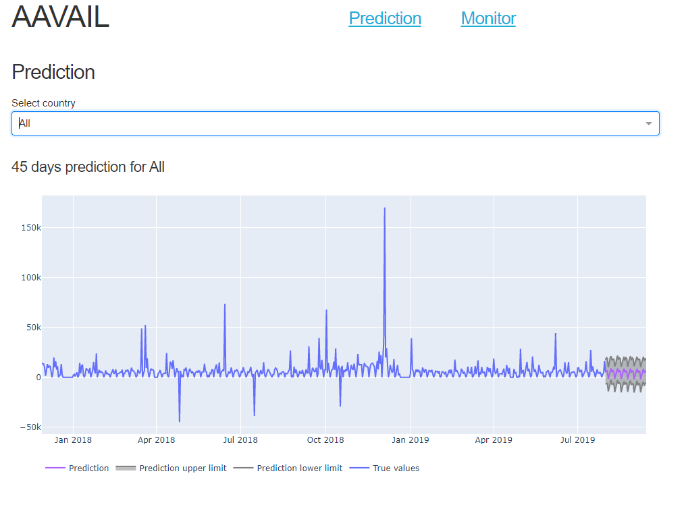
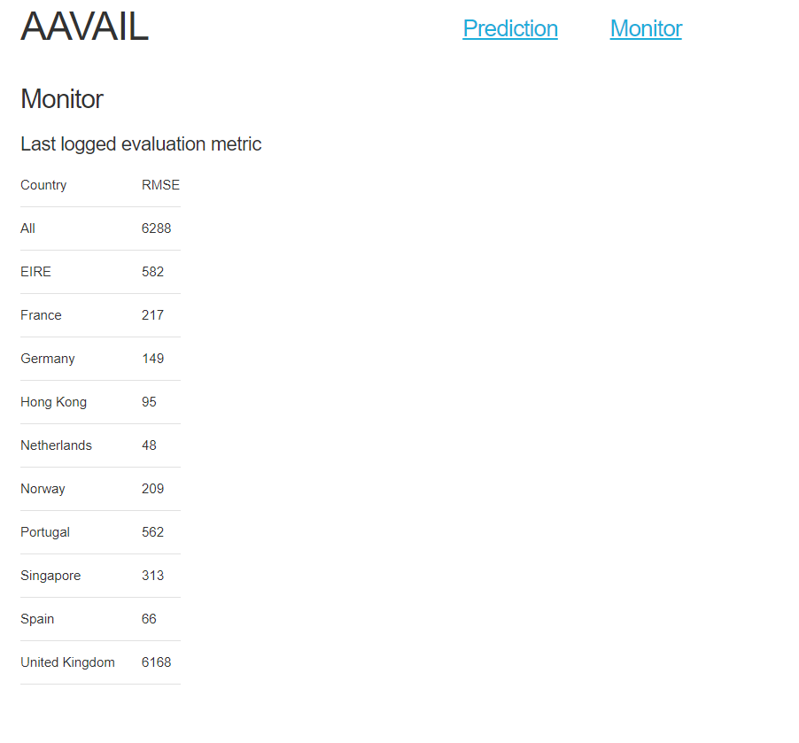

# IBM AI Workflow Capstone Project

The IBM AI Workflow capstone project is part of the evaluation for the [IBM AI Workflow Coursera specialization](https://www.coursera.org/specializations/ibm-ai-workflow). 
In short, it simulates the full cycle of a data science project, and consists of understanding the data and the business opportunity related to a fictitious video streaming company; comparing models and choosing the adequate one; and developing a solution ready for deployment, including creating an API with the needed endpoints and building a Docker image to containing the solution. More information can be found [here](https://github.com/aavail/ai-workflow-capstone) or at the specialization website.

The dataset presented consists of months worth of data coming from said streaming company, including information about views and revenue, as well as the countries originating those. The main business opportunity stated is to try to forecast revenue values.

The project is then composed of three parts. 
The first one involves investigating the data, searching for relationships therein, and articulating findings using visualizations.
The second one is comprised of trying different modelling approaches, and selecting one to be used for deployment, based on the observations.
Lastly, the third one consists of building a draft version of the API and serve it via a Docker image.

## Part 1

As mentioned, the main goal of Part 1 was to find insights in the data, and to communicate those using visualizations.
The notebook ``Part 1 - Data investigation.ipynb`` contains analyses and plots, inspecting missing values, data grouped by country and as time series.
It makes use of ingestion functions to automate the process.

## Part 2

In Part 2, one should compare different methods and study the one best suited for the problem.
The notebook ``Part 2 - Model building and selection.ipynb`` compares three different models. We use a simple moving average algorithm as the baseline, and inspect two other approaches: 
one using [FB Prophet](https://facebook.github.io/prophet/) and one using engineered features and Random Forest. In our tests, Prophet performed the best, and was chosen as the prediction algorithm.

## Part 3

Part 3 consists of building a draft of the full solution, including getting the model ready; creating an API; creating unit tests for components; and bundle the API in a Docker image.
Additionally, a web interface was created for visualizing predicitons and monitoring information.

### Model

Main model methods (train, load and predict) are implemented in ``application/model.py``. Training can be started using ``run-train.py`` in the root folder.
By default, it will use the files in the ``data/cs-train`` folder.

### API

The designed API has endpoints for training, predicting and accessing logfiles. These are the main routes:

- ``/train``: should receive a JSON containing the "mode" ("test" or "prod") and trains the models in the given mode
- ``/predict``: should receive a JSON containing the "mode" and a "query", which is an object specifying 
- ``/logs/``: returns a list of logfiles
- ``/logs/<logfile>``: returns ``logfile``

The API can be started by running ``app.py``, and listens on port ``8050``.

### Unit testing

Unit tests were implemented for the API, model and logging. They are available in the ``unittests`` folder.
All unit tests can be run using ``run-tests.py``.

### Docker

A Docker image was built using the ``Dockerfile`` in the repository, and was made available at Docker hub as ``rdpb/ibm-ai-capstone``. It can be obtained by running ``docker pull rdpb/ibm-ai-capstone:latest``. Alternatively, one can build the image from the ``Dockerfile`` by running ``docker build -t rdpb/ibm-ai-capstone``.

With the built image, one can run the container with ``docker run -p 8050:8050 rdpb/ibm-ai-capstone``

### Web interface

Bundled with the API, there is a simple web interface made with [Dash](https://plotly.com/dash/) (which is made on top of Flask).
After starting ``app.py``, if one points the browser to the `/` endpoint (e.g. ``http://127.0.0.1:8050`` if running locally), one should 
see a dropdown menu for selecting a country and model predictions for the next 45 days for that country.

At ``/monitor`` (or via the menu at the top of the page), one can access the latest metrics from training, which can be used for monitoring. 

